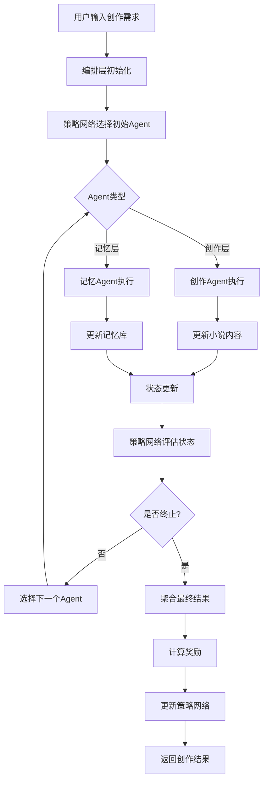

***REMOVED*** AI小说创作助手 - 架构设计

> 基于动态编排多智能体系统（Puppeteer）的架构设计

***REMOVED******REMOVED*** 📐 整体架构图

```
┌─────────────────────────────────────────────────────────────────────────┐
│                         AI小说创作助手系统                                │
└─────────────────────────────────────────────────────────────────────────┘
                                    │
                    ┌───────────────┴───────────────┐
                    │                               │
            ┌───────▼────────┐              ┌───────▼────────┐
            │   任务输入层    │              │   评估反馈层    │
            │  - 创作需求     │              │  - 质量评估     │
            │  - 用户指令     │              │  - 奖励计算     │
            │  - 约束条件     │              │  - 策略更新     │
            └───────┬────────┘              └───────┬────────┘
                    │                               │
                    └───────────────┬───────────────┘
                                    │
                    ┌───────────────▼───────────────┐
                    │     编排层（Puppeteer/导演）    │
                    │  ┌─────────────────────────┐ │
                    │  │   策略网络（RL Policy）  │ │
                    │  │  - 状态表示（Embedding） │ │
                    │  │  - MLP 策略网络         │ │
                    │  │  - REINFORCE 算法       │ │
                    │  └─────────────────────────┘ │
                    │  ┌─────────────────────────┐ │
                    │  │   动态编排引擎           │ │
                    │  │  - Agent 选择           │ │
                    │  │  - 路径管理             │ │
                    │  │  - 状态更新             │ │
                    │  └─────────────────────────┘ │
                    │  ┌─────────────────────────┐ │
                    │  │   图结构管理             │ │
                    │  │  - Agent 图              │ │
                    │  │  - Action 图              │ │
                    │  │  - 协作模式记录          │ │
                    │  └─────────────────────────┘ │
                    └───────────────┬───────────────┘
                                    │
                    ┌───────────────┴───────────────┐
                    │                               │
        ┌───────────▼──────────┐        ┌───────────▼──────────┐
        │    创作层 Agent      │        │    记忆层 Agent      │
        │  (创作子代理)        │        │  (记忆子代理)        │
        └───────────┬──────────┘        └───────────┬──────────┘
                    │                               │
    ┌───────────────┼───────────────┐   ┌──────────┼──────────┐
    │               │               │   │          │          │
┌───▼───┐   ┌──────▼──────┐  ┌────▼────┐ │    ┌────▼────┐  │
│大纲   │   │情节         │  │角色     │ │    │记忆压缩 │  │
│Agent  │   │Agent        │  │Agent   │ │    │Agent    │  │
└───┬───┘   └──────┬──────┘  └────┬────┘ │    └────┬────┘  │
    │              │               │      │         │       │
┌───▼───┐   ┌──────▼──────┐  ┌────▼────┐ │    ┌────▼────┐  │
│文笔   │   │世界观       │  │审核     │ │    │动态更新 │  │
│Agent  │   │Agent        │  │Agent   │ │    │Agent    │  │
└───────┘   └─────────────┘  └─────────┘ │    └────┬────┘  │
                                         │         │       │
                                    ┌────▼────┐  ┌────▼────┐
                                    │记忆重组 │  │人物关系 │
                                    │Agent    │  │Agent    │
                                    └────┬────┘  └────┬────┘
                                         │           │
                                    ┌────▼────┐      │
                                    │事件线索 │      │
                                    │Agent    │      │
                                    └─────────┘      │
                                         │           │
                                         └─────┬─────┘
                                               │
                                    ┌──────────▼──────────┐
                                    │   共享记忆库         │
                                    │  - 小说状态         │
                                    │  - 角色信息         │
                                    │  - 情节线索         │
                                    │  - 世界观设定       │
                                    └─────────────────────┘
```

***REMOVED******REMOVED*** 🎯 核心组件详解

***REMOVED******REMOVED******REMOVED*** 1. 编排层（Puppeteer/导演）

**职责：**
- 根据当前任务状态动态选择下一个执行的 Agent
- 管理多个并行推理路径
- 优化协作模式（通过强化学习）

**核心模块：**

```
编排层
├── 策略网络（Policy Network）
│   ├── 状态表示模块
│   │   └── 使用 Reward Model 编码当前状态
│   ├── MLP 网络
│   │   └── 输入：状态向量
│   │   └── 输出：Agent 选择概率分布
│   └── REINFORCE 算法
│       └── 根据奖励更新策略参数
│
├── 动态编排引擎
│   ├── Agent 选择器
│   │   └── 基于策略网络输出选择 Agent
│   ├── 路径管理器
│   │   ├── 初始化推理路径
│   │   ├── 路径分裂（多个候选 Agent）
│   │   └── 路径终止判断
│   └── 状态更新器
│       └── 更新全局状态（GlobalInfo）
│
└── 图结构管理
    ├── Agent 图
    │   └── 记录 Agent 之间的协作关系
    └── Action 图
        └── 记录动作执行顺序和依赖
```

***REMOVED******REMOVED******REMOVED*** 2. 创作层 Agent（创作子代理）

**Agent 列表：**

| Agent | 职责 | 主要动作 | 工具支持 |
|-------|------|---------|---------|
| **大纲Agent** | 生成小说大纲 | `planning`, `reasoning` | - |
| **情节Agent** | 设计情节发展 | `reasoning`, `modify` | - |
| **角色Agent** | 塑造角色形象 | `reasoning`, `reflect` | - |
| **文笔Agent** | 优化文字表达 | `modify`, `critique` | - |
| **世界观Agent** | 构建世界观设定 | `world_building`, `reasoning` | `search_arxiv`, `read_file` |
| **审核Agent** | 审核内容质量 | `critique`, `conclude` | - |

**协作模式示例：**
```
大纲Agent → 情节Agent → 角色Agent → 文笔Agent → 审核Agent
    ↓           ↓           ↓           ↓           ↓
  生成大纲   设计情节    塑造角色    优化文笔    审核内容
    ↓           ↓           ↓           ↓           ↓
    └───────────┴───────────┴───────────┴───────────┘
                    │
            (如果审核不通过)
                    │
            ┌───────┴───────┐
            │               │
        文笔Agent      情节Agent
    (重新优化)      (调整情节)
```

***REMOVED******REMOVED******REMOVED*** 3. 记忆层 Agent（记忆子代理）

**Agent 列表：**

| Agent | 职责 | 主要动作 | 工具支持 |
|-------|------|---------|---------|
| **记忆压缩Agent** | 压缩冗余记忆 | `summarize`, `reasoning` | - |
| **动态更新Agent** | 更新记忆内容 | `modify`, `reasoning` | - |
| **记忆重组Agent** | 重组记忆结构 | `planning`, `reflect` | - |
| **人物关系Agent** | 维护人物关系图 | `reasoning`, `conclude` | - |
| **事件线索Agent** | 追踪事件线索 | `reasoning`, `question` | - |

**记忆库结构：**
```json
{
  "novel_state": {
    "current_chapter": 5,
    "total_chapters": 20,
    "progress": 0.25
  },
  "characters": {
    "character_1": {
      "name": "...",
      "attributes": {...},
      "relationships": {...}
    }
  },
  "plot_lines": [
    {
      "line_id": "...",
      "events": [...],
      "status": "ongoing"
    }
  ],
  "world_building": {
    "settings": {...},
    "rules": {...}
  }
}
```

***REMOVED******REMOVED*** 🔄 执行流程

***REMOVED******REMOVED******REMOVED*** 完整创作流程



***REMOVED******REMOVED******REMOVED*** 动态编排示例

```
时间步 1: 策略选择 → [大纲Agent]
        大纲Agent 执行 → 生成初步大纲
        状态更新: {大纲: "...", 章节: 0}

时间步 2: 策略选择 → [情节Agent, 角色Agent]  (并行)
        情节Agent 执行 → 设计第一章情节
        角色Agent 执行 → 创建主要角色
        状态更新: {大纲: "...", 情节: "...", 角色: "..."}

时间步 3: 策略选择 → [文笔Agent]
        文笔Agent 执行 → 优化第一章文字
        状态更新: {第一章: "..."}

时间步 4: 策略选择 → [审核Agent]
        审核Agent 执行 → 审核第一章质量
        状态更新: {审核结果: "..."}

时间步 5: 策略选择 → [文笔Agent]  (环状结构：重新优化)
        文笔Agent 执行 → 根据审核意见修改
        状态更新: {第一章: "修改后..."}

时间步 6: 策略选择 → [Terminator]
        终止，输出最终结果
```

***REMOVED******REMOVED*** 🧠 强化学习机制

***REMOVED******REMOVED******REMOVED*** 奖励函数设计

```python
R = 质量分 - λ × 成本分

其中：
- 质量分 = f(内容质量, 情节连贯性, 角色一致性, ...)
- 成本分 = Token消耗 × 模型大小 × 步数
- λ = 成本权重系数（可调）
```

***REMOVED******REMOVED******REMOVED*** 状态表示

```python
State = {
    "task": "创作需求",
    "workflow": [
        {
            "agent": "大纲Agent",
            "action": "planning",
            "result": "...",
            "cost": 1000
        },
        ...
    ],
    "memory": {
        "characters": {...},
        "plot": {...},
        ...
    },
    "current_content": "当前章节内容"
}

State_Embedding = RewardModel.encode(State)
```

***REMOVED******REMOVED******REMOVED*** 策略网络

```
输入: State_Embedding (维度: 768/1536)
  ↓
MLP: 768 → 512 → 128 → 32 → N (N = Agent数量)
  ↓
输出: Agent 选择概率分布
  ↓
采样/选择: 根据概率选择下一个 Agent
```

***REMOVED******REMOVED*** 📊 图结构演化

***REMOVED******REMOVED******REMOVED*** Agent 协作图

```
初始状态（训练前）:
大纲Agent → 情节Agent → 角色Agent → 文笔Agent → 审核Agent
(线性结构，死板)

训练后（进化后）:
         ┌─────────────┐
         │  大纲Agent  │
         └──────┬──────┘
                │
         ┌──────▼──────┐
         │  情节Agent  │
         └──────┬──────┘
                │
    ┌───────────┼───────────┐
    │           │           │
┌───▼───┐  ┌───▼───┐  ┌───▼───┐
│角色   │  │世界观 │  │记忆   │
│Agent  │  │Agent  │  │Agent  │
└───┬───┘  └───┬───┘  └───┬───┘
    │          │          │
    └──────────┼──────────┘
               │
         ┌─────▼─────┐
         │ 文笔Agent │
         └─────┬─────┘
               │
         ┌─────▼─────┐
         │ 审核Agent │
         └─────┬─────┘
               │
         ┌─────▼─────┐
         │文笔Agent  │ ← 环状结构：根据审核结果重新优化
         └───────────┘
(紧凑的环状结构，高效协作)
```

***REMOVED******REMOVED*** 🔧 技术栈

***REMOVED******REMOVED******REMOVED*** 核心框架
- **编排框架**: Puppeteer (基于 REINFORCE 的动态编排)
- **LLM**: GPT-4o, Qwen-2.5, Claude (可配置)
- **强化学习**: REINFORCE, 可扩展为 PPO/A3C
- **状态表示**: Reward Model (Llama-3.1-Nemotron-70B-Reward)

***REMOVED******REMOVED******REMOVED*** 数据存储
- **记忆库**: Neo4j (图数据库，存储人物关系、事件线索)
- **文件系统**: DeepAgents CompositeBackend
- **配置管理**: YAML + JSON

***REMOVED******REMOVED******REMOVED*** 工具支持
- **搜索工具**: ArXiv, Bing, Web Access
- **代码执行**: Python Interpreter
- **文件操作**: Read/Write/Format

***REMOVED******REMOVED*** 📈 性能优化

***REMOVED******REMOVED******REMOVED*** 并行化
- 多路径并行推理（最多 4 条路径）
- Agent 执行可异步化
- 工具调用可并行

***REMOVED******REMOVED******REMOVED*** 缓存机制
- LLM 查询结果缓存
- 工具执行结果缓存
- 状态表示缓存

***REMOVED******REMOVED******REMOVED*** 路径剪枝
- 早期终止低质量路径
- 动态调整并行路径数
- 成本超限自动终止

***REMOVED******REMOVED*** 🎯 关键特性

1. **动态编排**: 根据状态实时选择 Agent，不依赖固定流程
2. **自适应学习**: 通过强化学习优化协作模式
3. **环状协作**: 自动涌现出"反复打磨"的协作模式
4. **记忆管理**: 智能压缩、更新、重组记忆
5. **成本优化**: 平衡质量与成本，自动学习高效策略

---

*架构设计版本: v1.0*
*基于: Puppeteer (NeurIPS 2025)*


