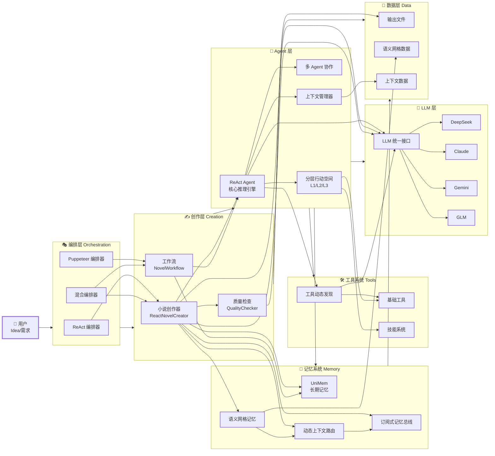
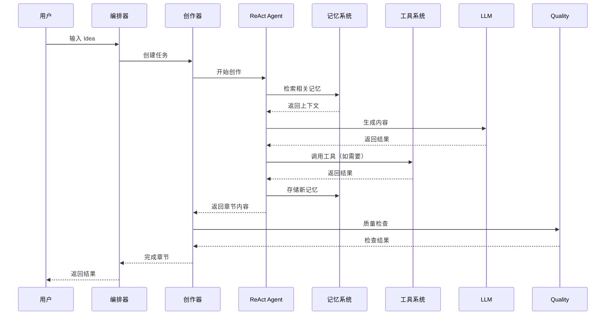

 Creator 项目架构

 主路径 vs 支线

当前端到端产品走**主路径**，其余为**支线**（有代码但未深度接入主产品）。

| 类型 | 说明 | 主要入口与模块 |
|------|------|----------------|
| **主路径** | 前端 → 创作/记忆 API → ReactNovelCreator + semantic_mesh（+ 可选 UniMem） | `api_flask.py`（/api/creator/run、/stream，/api/memory/*）→ `api/creator_handlers.py`、`api/memory_handlers.py` → `task/novel/react_novel_creator.py`、`context/` |
| **支线** | 多智能体编排、工作流定义，未接入 /api/creator | `workflow/`（NovelWorkflow、CreativeOrchestrator）、`puppeteer/`（GraphReasoning 等） |

新人改「创作流程」或「记忆/图谱」时，优先看主路径；Puppeteer/Workflow 标为实验或后续 DAG 备选，避免误以为必须维护。

 模块依赖简图

```
api_flask.py (HTTP)
    → api/creator_handlers, api/memory_handlers
        → task/novel/react_novel_creator, context (semantic_mesh)
        → unimem (可选，通过 memory_handlers 懒加载)
task.novel 不依赖 workflow、puppeteer
unimem 不反向依赖 api（通过配置/环境变量解耦）
```

 📐 系统架构图



 🏗️ 核心组件说明

 编排层 (Orchestration Layer)

- **ReAct 编排器**：基于 ReAct 的推理-行动循环
- **Puppeteer 编排器**：基于强化学习的动态编排（待完善）
- **混合编排器**：根据场景自动选择编排方式

 创作层 (Creation Layer)

- **小说创作器**：核心创作引擎，支持章节创作、大纲生成
- **工作流**：定义创作流程（大纲→人物→章节→检查）
- **质量检查**：多维度一致性检查（角色、设定、情节、风格）

 Agent 层

- **ReAct Agent**：核心推理引擎，支持工具调用和推理循环
- **多 Agent 协作**：Master/Sub 模式，支持任务委托和信息同步
- **上下文管理器**：自动管理上下文（Offloading、Compaction、Summarization）
- **分层行动空间**：L1（原子函数）/L2（沙盒工具）/L3（代码执行）

 记忆系统 (Memory System)

- **UniMem**：长期记忆系统，支持经验存储和检索
- **语义网格记忆**：实体-关系图谱，维护创作一致性
- **动态上下文路由**：根据用户行为预测并预加载上下文
- **订阅式记忆总线**：Agent 间实时通信，自动检测冲突

 工具系统 (Tools System)

- **工具动态发现**：Index Layer + Discovery Layer，减少 Token 消耗
- **基础工具**：read_file、write_file、execute_shell 等
- **技能系统**：高级技能封装
- **MCP 协议**：标准化工具协议

 LLM 层

- **统一接口**：抽象 LLM 调用
- **多模型支持**：DeepSeek、Claude、Gemini、GLM 等

 🔄 数据流



 📦 目录结构

```
src/
├── agent/               Agent 核心模块
│   ├── context_manager.py       上下文管理
│   ├── layered_action_space.py  分层行动空间
│   └── multi_agent.py           多 Agent 协作
├── context/              创作上下文系统（语义网格、动态路由、Pub/Sub）
│   ├── semantic_mesh_memory.py  语义网格记忆
│   ├── context_router.py        动态上下文路由
│   └── pubsub_memory_bus.py     订阅式记忆总线
├── task/                 任务层（按业务类型）
│   └── novel/            小说创作（原 novel_creation）
│   ├── react_novel_creator.py   核心创作器
│   ├── enhanced_entity_extractor.py  增强实体提取
│   ├── quality_checker.py       质量检查
│   └── unified_orchestrator.py  统一编排接口
├── orchestrator/        编排层（ReAct 等 Agentic 推理方式）
├── tools/               工具系统
│   ├── discovery.py             工具动态发现
│   └── search_tool_docs.py      工具文档搜索
├── llm/                 LLM 接口
├── unimem/              UniMem 记忆系统
├── puppeteer/           Puppeteer 编排系统
└── workflow/            工作流定义
```

 🎯 关键特性

 1. 动态编排
- 支持 ReAct 和 Puppeteer 两种编排方式
- 混合编排器自动选择最优方式

 2. 上下文管理
- **工具结果卸载**：结果超过500字符时自动写入文件，返回文件路径引用
- **聊天历史卸载**：上下文超过128K tokens时触发，生成摘要+文件引用，保留最近3条消息
- **终端会话卸载**：自动同步终端输出到文件系统
- **工具调用紧凑化**：移除可从外部状态重建的信息，只保留文件路径
- **智能压缩和摘要**：先 Compaction（无损），再 Summarization（有损但带保险）

 3. 记忆系统
- **语义网格记忆**：实体-关系图谱，维护创作一致性
  - 章节创作前：检索并注入前面章节的实体信息
  - 章节创作后：提取新章节的实体并存储
  - 质量检查：使用语义网格进行深度一致性检查
- **动态上下文路由**：根据用户行为预测并预加载上下文（未来）
- **订阅式记忆总线**：Agent 间实时通信，自动检测冲突（未来）
- **UniMem**：长期记忆系统（未来集成）

 4. 工具系统
- **工具动态发现**：Index Layer + Discovery Layer
  - Index Layer：系统提示词中只包含工具名称列表（72 tokens vs 156 tokens）
  - Discovery Layer：工具详细描述同步到 `tools/docs/`，Agent 按需查找
  - **Token 节省：53.8%**（超过预期 40-50%）
- **分层行动空间**：L1/L2/L3 三层架构
  - **L1（原子函数）**：固定、正交的原子函数（read_file, write_file, execute_shell等），对 KV Cache 友好
  - **L2（沙盒工具）**：预装在系统中的工具（grep, sed, awk, curl等），通过 L1 的 execute_shell 使用
  - **L3（软件包与 API）**：编写 Python 脚本执行复杂任务，调用预授权的 API
- **工具与技能**：以 CodeAct 模式为主流方向（工具发现 + skills 封装）

 5. 多 Agent 协作
- **Master Agent（主代理）**：创建和管理 Sub-Agent，协调多 Agent 协作
- **Sub-Agent（子代理）**：执行特定任务
- **两种协作模式**：
  - **任务委托（Task Delegation）**：通过通信实现隔离，Sub-agent 上下文完全独立，必须定义输出 Schema
  - **信息同步（Information Synchronization）**：通过共享上下文实现协作，Sub-agent 拥有 Master Agent 的完整历史上下文
- **共享沙箱**：Master 和 Sub-agent 共享同一沙箱，通过文件路径传递信息

 6. 实体提取系统
- **多模型投票提取**：使用多个 LLM 模型（`kimi_k2` + `gemini_3_flash`）并行提取实体
  - 主模型优先策略：优先保留 Kimi K2 的所有提取结果
  - 投票机制：只保留至少2个模型都提取到的实体
  - **提取精度：95%+**
- **实体类型**：角色、组织、地点、物品、生物、概念、时间
- **实体验证**：长度检查、动作词过滤、介词过滤、句子片段过滤

 7. 质量保证
- **多维度质量检查**：一致性、连贯性、风格等
- **实体一致性验证**：使用语义网格进行深度检查
- **情节逻辑检查**：确保前后章节逻辑连贯

 🚀 快速开始

 基础使用

```python
from task.novel.react_novel_creator import ReactNovelCreator

creator = ReactNovelCreator(
    novel_title="我的小说",
    enable_enhanced_extraction=True,
    enable_quality_check=True
)

result = creator.create_novel(
    genre="科幻",
    theme="时间旅行",
    target_chapters=10,
    words_per_chapter=3000
)
```

 测试

- **主路径集成测试**：`api/test_creator_integration.py` 校验 POST /api/creator/run (mode=create) → 轮询 task → outputs 下 novel_plan.json 存在（mock LLM，环境不可用时 skip）。运行：`cd src && python -m pytest api/test_creator_integration.py -v`。

```bash
 运行端到端测试（真实 LLM，需在 src 下执行）
python -m task.novel.test_quality_optimizations --title "测试小说" --genre "科幻" --chapters 5 --words 2000
```

- **100 章创作、测试监控脚本**：见 [`scripts/novel/README.md`](./scripts/novel/README.md)。

 📚 文档

- **小说创作系统**：详细文档请参考 [`task/novel/README.md`](./task/novel/README.md)
  - 包含完整的使用指南、LLM 配置、优化功能、重写机制等

 🔧 技术栈

- **Python 3.8+**
- **ReAct Agent**：推理-行动循环
- **UniMem**：长期记忆系统
- **工具与技能**：tools + skills，以 CodeAct 模式为主流
- **多 LLM 支持**：DeepSeek、Claude、Gemini、GLM

 📝 开发规范

- 代码清晰可读，逻辑严谨，结构精简，性能稳定
- 每个模块目录下如果有文档，就只要 README.md
