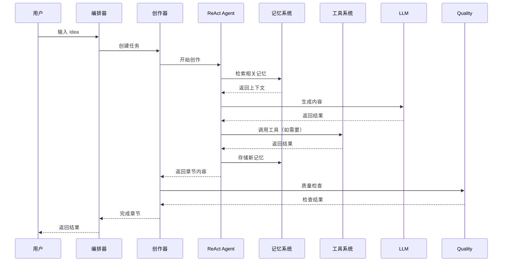

***REMOVED*** Creator 项目架构

***REMOVED******REMOVED*** 📐 系统架构图

```mermaid
graph LR
    %% 用户输入
    User[👤 用户<br/>Idea/需求]:::user
    
    %% 编排层
    subgraph Orchestration["🎭 编排层 Orchestration"]
        direction TB
        ReAct[ReAct 编排器]:::orchestration
        Puppeteer[Puppeteer 编排器]:::orchestration
        Hybrid[混合编排器]:::orchestration
    end
    
    %% 创作层
    subgraph Creation["✍️ 创作层 Creation"]
        direction TB
        NovelCreator[小说创作器<br/>ReactNovelCreator]:::creation
        Workflow[工作流<br/>NovelWorkflow]:::creation
        Quality[质量检查<br/>QualityChecker]:::creation
    end
    
    %% Agent 层
    subgraph Agent["🤖 Agent 层"]
        direction TB
        ReActAgent[ReAct Agent<br/>核心推理引擎]:::agent
        MultiAgent[多 Agent 协作]:::agent
        ContextMgr[上下文管理器]:::agent
        ActionSpace[分层行动空间<br/>L1/L2/L3]:::agent
    end
    
    %% 记忆系统
    subgraph Memory["🧠 记忆系统 Memory"]
        direction TB
        UniMem[UniMem<br/>长期记忆]:::memory
        SemanticMesh[语义网格记忆]:::memory
        ContextRouter[动态上下文路由]:::memory
        PubSub[订阅式记忆总线]:::memory
    end
    
    %% 工具系统
    subgraph Tools["🛠️ 工具系统 Tools"]
        direction TB
        ToolDiscovery[工具动态发现]:::tools
        BasicTools[基础工具]:::tools
        Skills[技能系统]:::tools
        MCP[MCP 协议]:::tools
    end
    
    %% LLM 层
    subgraph LLM["💬 LLM 层"]
        direction TB
        LLMInterface[LLM 统一接口]:::llm
        DeepSeek[DeepSeek]:::llm
        Claude[Claude]:::llm
        Gemini[Gemini]:::llm
        GLM[GLM]:::llm
    end
    
    %% 数据层
    subgraph Data["💾 数据层 Data"]
        direction TB
        Output[输出文件]:::data
        MeshData[语义网格数据]:::data
        ContextData[上下文数据]:::data
    end
    
    %% 主要数据流
    User --> Orchestration
    Orchestration --> Creation
    Creation --> Agent
    Agent --> Memory
    Agent --> Tools
    Agent --> LLM
    Creation --> Data
    Memory --> Data
    
    %% 编排层内部连接
    ReAct --> NovelCreator
    Puppeteer --> Workflow
    Hybrid --> NovelCreator
    Hybrid --> Workflow
    
    %% 创作层内部连接
    NovelCreator --> Quality
    NovelCreator --> ReActAgent
    Workflow --> ReActAgent
    
    %% Agent 层内部连接
    ReActAgent --> ContextMgr
    ReActAgent --> ActionSpace
    ReActAgent --> MultiAgent
    ReActAgent --> ToolDiscovery
    
    %% 工具系统内部连接
    ToolDiscovery --> BasicTools
    ActionSpace --> BasicTools
    ActionSpace --> Skills
    ActionSpace --> MCP
    
    %% 记忆系统内部连接
    NovelCreator --> SemanticMesh
    NovelCreator --> ContextRouter
    NovelCreator --> PubSub
    NovelCreator --> UniMem
    Workflow --> UniMem
    SemanticMesh --> ContextRouter
    ContextRouter --> PubSub
    
    %% LLM 调用
    ReActAgent --> LLMInterface
    Quality --> LLMInterface
    NovelCreator --> LLMInterface
    ToolDiscovery --> LLMInterface
    
    %% LLM 实现
    LLMInterface --> DeepSeek
    LLMInterface --> Claude
    LLMInterface --> Gemini
    LLMInterface --> GLM
    
    %% 数据输出
    NovelCreator --> Output
    SemanticMesh --> MeshData
    ContextMgr --> ContextData
    
    %% 样式定义
    classDef user fill:***REMOVED***fff9c4,stroke:***REMOVED***f57f17,stroke-width:3px
    classDef orchestration fill:***REMOVED***e1f5ff,stroke:***REMOVED***01579b,stroke-width:2px
    classDef creation fill:***REMOVED***f3e5f5,stroke:***REMOVED***4a148c,stroke-width:2px
    classDef agent fill:***REMOVED***e8f5e9,stroke:***REMOVED***1b5e20,stroke-width:2px
    classDef memory fill:***REMOVED***fff3e0,stroke:***REMOVED***e65100,stroke-width:2px
    classDef tools fill:***REMOVED***fce4ec,stroke:***REMOVED***880e4f,stroke-width:2px
    classDef llm fill:***REMOVED***e0f2f1,stroke:***REMOVED***004d40,stroke-width:2px
    classDef data fill:***REMOVED***f5f5f5,stroke:***REMOVED***424242,stroke-width:2px
```

***REMOVED******REMOVED*** 🏗️ 核心组件说明

***REMOVED******REMOVED******REMOVED*** 编排层 (Orchestration Layer)

- **ReAct 编排器**：基于 ReAct 的推理-行动循环
- **Puppeteer 编排器**：基于强化学习的动态编排（待完善）
- **混合编排器**：根据场景自动选择编排方式

***REMOVED******REMOVED******REMOVED*** 创作层 (Creation Layer)

- **小说创作器**：核心创作引擎，支持章节创作、大纲生成
- **工作流**：定义创作流程（大纲→人物→章节→检查）
- **质量检查**：多维度一致性检查（角色、设定、情节、风格）

***REMOVED******REMOVED******REMOVED*** Agent 层

- **ReAct Agent**：核心推理引擎，支持工具调用和推理循环
- **多 Agent 协作**：Master/Sub 模式，支持任务委托和信息同步
- **上下文管理器**：自动管理上下文（Offloading、Compaction、Summarization）
- **分层行动空间**：L1（原子函数）/L2（沙盒工具）/L3（代码执行）

***REMOVED******REMOVED******REMOVED*** 记忆系统 (Memory System)

- **UniMem**：长期记忆系统，支持经验存储和检索
- **语义网格记忆**：实体-关系图谱，维护创作一致性
- **动态上下文路由**：根据用户行为预测并预加载上下文
- **订阅式记忆总线**：Agent 间实时通信，自动检测冲突

***REMOVED******REMOVED******REMOVED*** 工具系统 (Tools System)

- **工具动态发现**：Index Layer + Discovery Layer，减少 Token 消耗
- **基础工具**：read_file、write_file、execute_shell 等
- **技能系统**：高级技能封装
- **MCP 协议**：标准化工具协议

***REMOVED******REMOVED******REMOVED*** LLM 层

- **统一接口**：抽象 LLM 调用
- **多模型支持**：DeepSeek、Claude、Gemini、GLM 等

***REMOVED******REMOVED*** 🔄 数据流



***REMOVED******REMOVED*** 📦 目录结构

```
src/
├── agent/              ***REMOVED*** Agent 核心模块
│   ├── context_manager.py      ***REMOVED*** 上下文管理
│   ├── layered_action_space.py ***REMOVED*** 分层行动空间
│   └── multi_agent.py          ***REMOVED*** 多 Agent 协作
├── creative_context/    ***REMOVED*** 创作上下文系统
│   ├── semantic_mesh_memory.py ***REMOVED*** 语义网格记忆
│   ├── context_router.py       ***REMOVED*** 动态上下文路由
│   └── pubsub_memory_bus.py    ***REMOVED*** 订阅式记忆总线
├── novel_creation/      ***REMOVED*** 小说创作模块
│   ├── react_novel_creator.py  ***REMOVED*** 核心创作器
│   ├── enhanced_entity_extractor.py ***REMOVED*** 增强实体提取
│   ├── quality_checker.py      ***REMOVED*** 质量检查
│   └── unified_orchestrator.py ***REMOVED*** 统一编排接口
├── react.py            ***REMOVED*** ReAct Agent 实现
├── tools/              ***REMOVED*** 工具系统
│   ├── discovery.py            ***REMOVED*** 工具动态发现
│   └── search_tool_docs.py     ***REMOVED*** 工具文档搜索
├── llm/                ***REMOVED*** LLM 接口
├── unimem/             ***REMOVED*** UniMem 记忆系统
├── puppeteer/          ***REMOVED*** Puppeteer 编排系统
├── mcp/                ***REMOVED*** MCP 协议
└── workflow/           ***REMOVED*** 工作流定义
```

***REMOVED******REMOVED*** 🎯 关键特性

***REMOVED******REMOVED******REMOVED*** 1. 动态编排
- 支持 ReAct 和 Puppeteer 两种编排方式
- 混合编排器自动选择最优方式

***REMOVED******REMOVED******REMOVED*** 2. 上下文管理
- 自动卸载冗长内容
- 智能压缩和摘要
- 分层行动空间优化

***REMOVED******REMOVED******REMOVED*** 3. 记忆系统
- 长期记忆（UniMem）
- 语义网格记忆（实体-关系图谱）
- 动态上下文路由
- 订阅式记忆总线

***REMOVED******REMOVED******REMOVED*** 4. 工具系统
- 工具动态发现（减少 Token 消耗 53.8%）
- 分层行动空间（L1/L2/L3）
- MCP 协议支持

***REMOVED******REMOVED******REMOVED*** 5. 质量保证
- 多维度质量检查
- 实体一致性验证
- 情节逻辑检查

***REMOVED******REMOVED*** 🚀 快速开始

***REMOVED******REMOVED******REMOVED*** 基础使用

```python
from novel_creation.react_novel_creator import ReactNovelCreator

creator = ReactNovelCreator(
    novel_title="我的小说",
    enable_enhanced_extraction=True,
    enable_quality_check=True
)

result = creator.create_novel(
    genre="科幻",
    theme="时间旅行",
    target_chapters=10,
    words_per_chapter=3000
)
```

***REMOVED******REMOVED******REMOVED*** 测试

```bash
***REMOVED*** 运行端到端测试
python novel_creation/test_full_novel_creation.py \
    --title "测试小说" \
    --genre "科幻" \
    --chapters 5 \
    --words 2000
```

***REMOVED******REMOVED*** 📚 文档

详细文档请参考 `docs/` 目录：

- [项目状态分析](./docs/PROJECT_STATUS_ANALYSIS.md)
- [下一步行动建议](./docs/NEXT_STEPS_RECOMMENDATION.md)
- [测试指南](../novel_creation/TESTING_GUIDE.md)
- [完整实施总结](./docs/FINAL_IMPLEMENTATION_SUMMARY.md)

***REMOVED******REMOVED*** 🔧 技术栈

- **Python 3.8+**
- **ReAct Agent**：推理-行动循环
- **UniMem**：长期记忆系统
- **MCP**：Model Context Protocol
- **多 LLM 支持**：DeepSeek、Claude、Gemini、GLM

***REMOVED******REMOVED*** 📝 开发规范

- 代码清晰可读，逻辑严谨，结构精简，性能稳定
- 每个模块目录下如果有文档，就只要 README.md
