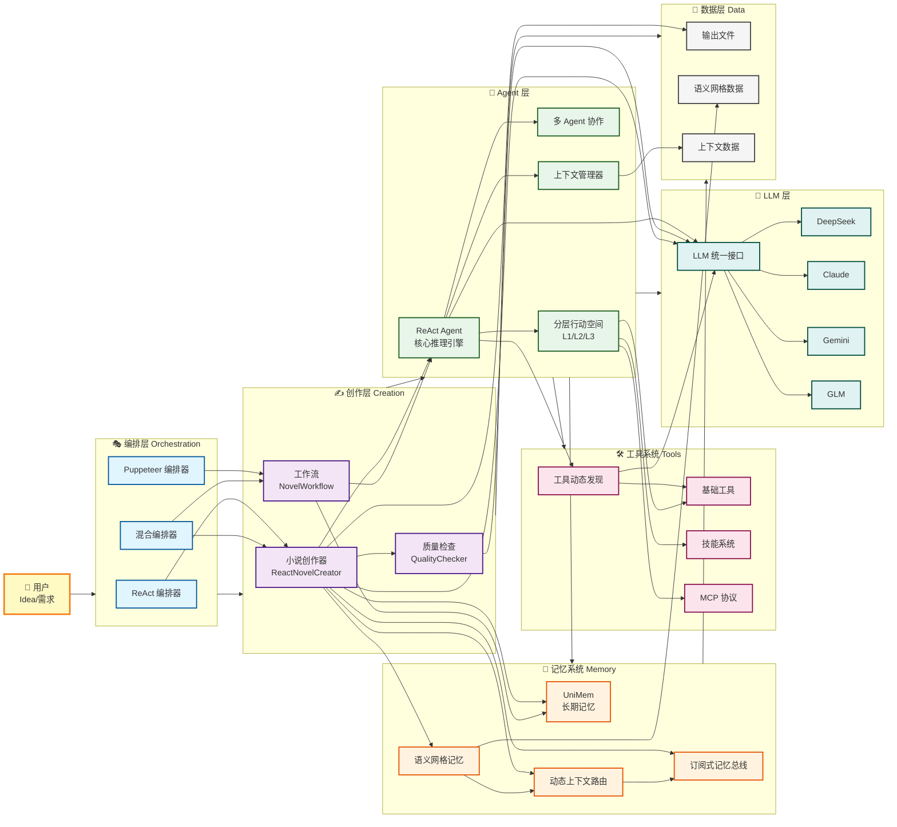
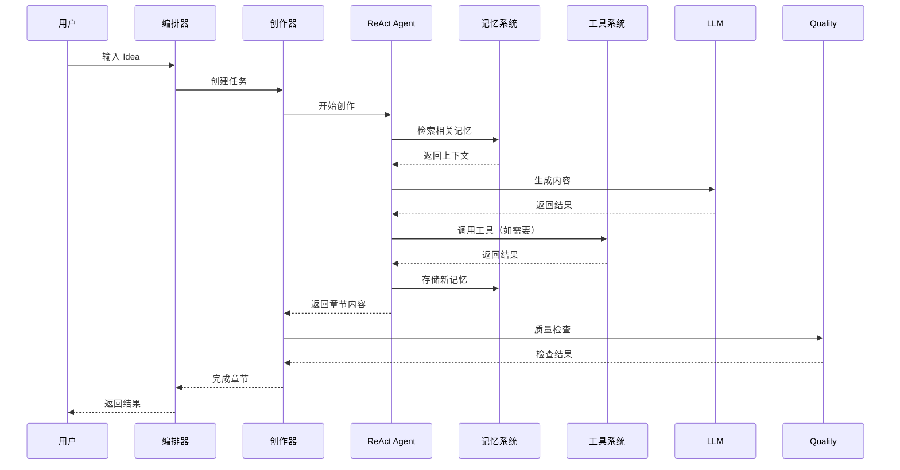

# Creator 项目架构

## 📐 系统架构图


```mermaid
graph LR
    %% 用户输入
    User[👤 用户<br/>Idea/需求]:::user
    
    %% 编排层
    subgraph Orchestration["🎭 编排层 Orchestration"]
        direction TB
        ReAct[ReAct 编排器]:::orchestration
        Puppeteer[Puppeteer 编排器]:::orchestration
        Hybrid[混合编排器]:::orchestration
    end
    
    %% 创作层
    subgraph Creation["✍️ 创作层 Creation"]
        direction TB
        NovelCreator[小说创作器<br/>ReactNovelCreator]:::creation
        Workflow[工作流<br/>NovelWorkflow]:::creation
        Quality[质量检查<br/>QualityChecker]:::creation
    end
    
    %% Agent 层
    subgraph Agent["🤖 Agent 层"]
        direction TB
        ReActAgent[ReAct Agent<br/>核心推理引擎]:::agent
        MultiAgent[多 Agent 协作]:::agent
        ContextMgr[上下文管理器]:::agent
        ActionSpace[分层行动空间<br/>L1/L2/L3]:::agent
    end
    
    %% 记忆系统
    subgraph Memory["🧠 记忆系统 Memory"]
        direction TB
        UniMem[UniMem<br/>长期记忆]:::memory
        SemanticMesh[语义网格记忆]:::memory
        ContextRouter[动态上下文路由]:::memory
        PubSub[订阅式记忆总线]:::memory
    end
    
    %% 工具系统
    subgraph Tools["🛠️ 工具系统 Tools"]
        direction TB
        ToolDiscovery[工具动态发现]:::tools
        BasicTools[基础工具]:::tools
        Skills[技能系统]:::tools
        MCP[MCP 协议]:::tools
    end
    
    %% LLM 层
    subgraph LLM["💬 LLM 层"]
        direction TB
        LLMInterface[LLM 统一接口]:::llm
        DeepSeek[DeepSeek]:::llm
        Claude[Claude]:::llm
        Gemini[Gemini]:::llm
        GLM[GLM]:::llm
    end
    
    %% 数据层
    subgraph Data["💾 数据层 Data"]
        direction TB
        Output[输出文件]:::data
        MeshData[语义网格数据]:::data
        ContextData[上下文数据]:::data
    end
    
    %% 主要数据流
    User --> Orchestration
    Orchestration --> Creation
    Creation --> Agent
    Agent --> Memory
    Agent --> Tools
    Agent --> LLM
    Creation --> Data
    Memory --> Data
    
    %% 编排层内部连接
    ReAct --> NovelCreator
    Puppeteer --> Workflow
    Hybrid --> NovelCreator
    Hybrid --> Workflow
    
    %% 创作层内部连接
    NovelCreator --> Quality
    NovelCreator --> ReActAgent
    Workflow --> ReActAgent
    
    %% Agent 层内部连接
    ReActAgent --> ContextMgr
    ReActAgent --> ActionSpace
    ReActAgent --> MultiAgent
    ReActAgent --> ToolDiscovery
    
    %% 工具系统内部连接
    ToolDiscovery --> BasicTools
    ActionSpace --> BasicTools
    ActionSpace --> Skills
    ActionSpace --> MCP
    
    %% 记忆系统内部连接
    NovelCreator --> SemanticMesh
    NovelCreator --> ContextRouter
    NovelCreator --> PubSub
    NovelCreator --> UniMem
    Workflow --> UniMem
    SemanticMesh --> ContextRouter
    ContextRouter --> PubSub
    
    %% LLM 调用
    ReActAgent --> LLMInterface
    Quality --> LLMInterface
    NovelCreator --> LLMInterface
    ToolDiscovery --> LLMInterface
    
    %% LLM 实现
    LLMInterface --> DeepSeek
    LLMInterface --> Claude
    LLMInterface --> Gemini
    LLMInterface --> GLM
    
    %% 数据输出
    NovelCreator --> Output
    SemanticMesh --> MeshData
    ContextMgr --> ContextData
    
    %% 样式定义
    classDef user fill:#fff9c4,stroke:#f57f17,stroke-width:3px
    classDef orchestration fill:#e1f5ff,stroke:#01579b,stroke-width:2px
    classDef creation fill:#f3e5f5,stroke:#4a148c,stroke-width:2px
    classDef agent fill:#e8f5e9,stroke:#1b5e20,stroke-width:2px
    classDef memory fill:#fff3e0,stroke:#e65100,stroke-width:2px
    classDef tools fill:#fce4ec,stroke:#880e4f,stroke-width:2px
    classDef llm fill:#e0f2f1,stroke:#004d40,stroke-width:2px
    classDef data fill:#f5f5f5,stroke:#424242,stroke-width:2px
```

## 🏗️ 核心组件说明

### 编排层 (Orchestration Layer)

- **ReAct 编排器**：基于 ReAct 的推理-行动循环
- **Puppeteer 编排器**：基于强化学习的动态编排（待完善）
- **混合编排器**：根据场景自动选择编排方式

### 创作层 (Creation Layer)

- **小说创作器**：核心创作引擎，支持章节创作、大纲生成
- **工作流**：定义创作流程（大纲→人物→章节→检查）
- **质量检查**：多维度一致性检查（角色、设定、情节、风格）

### Agent 层

- **ReAct Agent**：核心推理引擎，支持工具调用和推理循环
- **多 Agent 协作**：Master/Sub 模式，支持任务委托和信息同步
- **上下文管理器**：自动管理上下文（Offloading、Compaction、Summarization）
- **分层行动空间**：L1（原子函数）/L2（沙盒工具）/L3（代码执行）

### 记忆系统 (Memory System)

- **UniMem**：长期记忆系统，支持经验存储和检索
- **语义网格记忆**：实体-关系图谱，维护创作一致性
- **动态上下文路由**：根据用户行为预测并预加载上下文
- **订阅式记忆总线**：Agent 间实时通信，自动检测冲突

### 工具系统 (Tools System)

- **工具动态发现**：Index Layer + Discovery Layer，减少 Token 消耗
- **基础工具**：read_file、write_file、execute_shell 等
- **技能系统**：高级技能封装
- **MCP 协议**：标准化工具协议

### LLM 层

- **统一接口**：抽象 LLM 调用
- **多模型支持**：DeepSeek、Claude、Gemini、GLM 等

## 🔄 数据流


```mermaid
sequenceDiagram
    participant User as 用户
    participant Orchestrator as 编排器
    participant Creator as 创作器
    participant Agent as ReAct Agent
    participant Memory as 记忆系统
    participant Tools as 工具系统
    participant LLM as LLM
    
    User->>Orchestrator: 输入 Idea
    Orchestrator->>Creator: 创建任务
    Creator->>Agent: 开始创作
    Agent->>Memory: 检索相关记忆
    Memory-->>Agent: 返回上下文
    Agent->>LLM: 生成内容
    LLM-->>Agent: 返回结果
    Agent->>Tools: 调用工具（如需要）
    Tools-->>Agent: 返回结果
    Agent->>Memory: 存储新记忆
    Agent-->>Creator: 返回章节内容
    Creator->>Quality: 质量检查
    Quality-->>Creator: 检查结果
    Creator-->>Orchestrator: 完成章节
    Orchestrator-->>User: 返回结果
```

## 📦 目录结构

```
src/
├── agent/              # Agent 核心模块
│   ├── context_manager.py      # 上下文管理
│   ├── layered_action_space.py # 分层行动空间
│   └── multi_agent.py          # 多 Agent 协作
├── creative_context/    # 创作上下文系统
│   ├── semantic_mesh_memory.py # 语义网格记忆
│   ├── context_router.py       # 动态上下文路由
│   └── pubsub_memory_bus.py    # 订阅式记忆总线
├── novel_creation/      # 小说创作模块
│   ├── react_novel_creator.py  # 核心创作器
│   ├── enhanced_entity_extractor.py # 增强实体提取
│   ├── quality_checker.py      # 质量检查
│   └── unified_orchestrator.py # 统一编排接口
├── react.py            # ReAct Agent 实现
├── tools/              # 工具系统
│   ├── discovery.py            # 工具动态发现
│   └── search_tool_docs.py     # 工具文档搜索
├── llm/                # LLM 接口
├── unimem/             # UniMem 记忆系统
├── puppeteer/          # Puppeteer 编排系统
├── mcp/                # MCP 协议
└── workflow/           # 工作流定义
```

## 🎯 关键特性

### 1. 动态编排
- 支持 ReAct 和 Puppeteer 两种编排方式
- 混合编排器自动选择最优方式

### 2. 上下文管理
- 自动卸载冗长内容
- 智能压缩和摘要
- 分层行动空间优化

### 3. 记忆系统
- 长期记忆（UniMem）
- 语义网格记忆（实体-关系图谱）
- 动态上下文路由
- 订阅式记忆总线

### 4. 工具系统
- 工具动态发现（减少 Token 消耗 53.8%）
- 分层行动空间（L1/L2/L3）
- MCP 协议支持

### 5. 质量保证
- 多维度质量检查
- 实体一致性验证
- 情节逻辑检查

## 🚀 快速开始

### 基础使用

```python
from novel_creation.react_novel_creator import ReactNovelCreator

creator = ReactNovelCreator(
    novel_title="我的小说",
    enable_enhanced_extraction=True,
    enable_quality_check=True
)

result = creator.create_novel(
    genre="科幻",
    theme="时间旅行",
    target_chapters=10,
    words_per_chapter=3000
)
```

### 测试

```bash
# 运行端到端测试
python novel_creation/test_full_novel_creation.py \
    --title "测试小说" \
    --genre "科幻" \
    --chapters 5 \
    --words 2000
```

## 📚 文档

详细文档请参考 `docs/` 目录：

- [项目状态分析](./docs/PROJECT_STATUS_ANALYSIS.md)
- [下一步行动建议](./docs/NEXT_STEPS_RECOMMENDATION.md)
- [测试指南](../novel_creation/TESTING_GUIDE.md)
- [完整实施总结](./docs/FINAL_IMPLEMENTATION_SUMMARY.md)

## 🔧 技术栈

- **Python 3.8+**
- **ReAct Agent**：推理-行动循环
- **UniMem**：长期记忆系统
- **MCP**：Model Context Protocol
- **多 LLM 支持**：DeepSeek、Claude、Gemini、GLM

## 📝 开发规范

- 代码清晰可读，逻辑严谨，结构精简，性能稳定
- 每个模块目录下如果有文档，就只要 README.md
