```mermaid
sequenceDiagram
    participant User as 用户
    participant Orchestrator as 编排器
    participant Creator as 创作器
    participant Agent as ReAct Agent
    participant Memory as 记忆系统
    participant Tools as 工具系统
    participant LLM as LLM
    
    User->>Orchestrator: 输入 Idea
    Orchestrator->>Creator: 创建任务
    Creator->>Agent: 开始创作
    Agent->>Memory: 检索相关记忆
    Memory-->>Agent: 返回上下文
    Agent->>LLM: 生成内容
    LLM-->>Agent: 返回结果
    Agent->>Tools: 调用工具（如需要）
    Tools-->>Agent: 返回结果
    Agent->>Memory: 存储新记忆
    Agent-->>Creator: 返回章节内容
    Creator->>Quality: 质量检查
    Quality-->>Creator: 检查结果
    Creator-->>Orchestrator: 完成章节
    Orchestrator-->>User: 返回结果
```

 Creator 项目架构

 主路径 vs 支线

当前端到端产品走**主路径**，其余为**支线**（有代码但未深度接入主产品；支线标**实验**，不承诺接入主产品）。

| 类型 | 说明 | 主要入口与模块 |
|------|------|----------------|
| **主路径** | 前端 → 创作/记忆 API → ReactNovelCreator + semantic_mesh（+ 可选 UniMem + 可选 EverMemOS 云记忆） | `api_flask.py`（/api/creator/run、/api/creator/stream（create/continue）、/api/creator/chapters、/api/creator/chapter 单章全文，/api/memory/*、/api/memory/evermemos）→ `api/creator_handlers.py`、`api/memory_handlers.py`、`api_EverMemOS.py` → `task/novel/react_novel_creator.py`、`context/` |
| **支线（实验）** | 多智能体编排、工作流定义，未接入 /api/creator | `orchestrator/` 等 — **标实验，后续 DAG 备选** |

**主路径创作流程**（与主页/创作页流程图一致）：构思 → 记忆召回（跨章人物、伏笔、长线设定）→ 续写 → 质检 ⇄ 重写 → 实体提取 → 记忆入库。流式接口仅用于 create/continue；润色走 `run_polish`（非 stream）。新人改「创作流程」或「记忆/图谱」时，优先看主路径；支线编排仅作实验或后续 DAG 备选，避免误以为必须维护。

 模块依赖简图

```
api_flask.py (HTTP)
    → api/creator_handlers, api/memory_handlers
        → task/novel/react_novel_creator, context (semantic_mesh)
        → unimem (可选，通过 memory_handlers 懒加载)
task.novel 不依赖 orchestrator 支线
unimem 不反向依赖 api（通过配置/环境变量解耦）
```

- **LLM 层**：门面与调用点见 [llm/README.md](llm/README.md)。
- **创作记忆**：mesh 读写 + UniMem 适配器（B.2），见 [api/README.md](api/README.md)；入口：read_mesh, write_mesh, recall_for_mode, retain_plan, retain_chapter, retain_polish, retain_chat。
- **创作路径与 project_id**：统一从 `config` 入口（project_dir, normalize_project_id, list_projects），见 [config/README.md](config/README.md)。
- **工具/技能统一（B.3）**：tools 注册+发现+调用（default_registry、get_discovery）；skills 为工具之上封装（SOP、规范、按需注入），见 [tools/README.md](tools/README.md)、[skills/README.md](skills/README.md)。编排层通过 tools 执行、skills 提供上下文。

 📐 系统架构图

```mermaid
graph LR
    %% 用户输入
    User[👤 用户<br/>Idea/需求]:::user
    
    %% 编排层
    subgraph Orchestration["🎭 编排层 Orchestration"]
        direction TB
        ReAct[ReAct 编排器]:::orchestration
        Hybrid[混合编排器]:::orchestration
    end
    
    %% 创作层
    subgraph Creation["✍️ 创作层 Creation"]
        direction TB
        NovelCreator[小说创作器<br/>ReactNovelCreator]:::creation
        Quality[质量检查<br/>QualityChecker]:::creation
    end
    
    %% Agent 层
    subgraph Agent["🤖 Agent 层"]
        direction TB
        ReActAgent[ReAct Agent<br/>核心推理引擎]:::agent
        MultiAgent[多 Agent 协作]:::agent
        ContextMgr[上下文管理器]:::agent
        ActionSpace[分层行动空间<br/>L1/L2/L3]:::agent
    end
    
    %% 记忆系统
    subgraph Memory["🧠 记忆系统 Memory"]
        direction TB
        UniMem[UniMem<br/>长期记忆]:::memory
        SemanticMesh[语义网格记忆]:::memory
        ContextRouter[动态上下文路由]:::memory
        PubSub[订阅式记忆总线]:::memory
    end
    
    %% 工具系统
    subgraph Tools["🛠️ 工具系统 Tools"]
        direction TB
        ToolDiscovery[工具动态发现]:::tools
        BasicTools[基础工具]:::tools
        Skills[技能系统]:::tools
    end
    
    %% LLM 层
    subgraph LLM["💬 LLM 层"]
        direction TB
        LLMInterface[LLM 统一接口]:::llm
        DeepSeek[DeepSeek]:::llm
        Claude[Claude]:::llm
        Gemini[Gemini]:::llm
        GLM[GLM]:::llm
    end
    
    %% 数据层
    subgraph Data["💾 数据层 Data"]
        direction TB
        Output[输出文件]:::data
        MeshData[语义网格数据]:::data
        ContextData[上下文数据]:::data
    end
    
    %% 主要数据流
    User --> Orchestration
    Orchestration --> Creation
    Creation --> Agent
    Agent --> Memory
    Agent --> Tools
    Agent --> LLM
    Creation --> Data
    Memory --> Data
    
    %% 编排层内部连接
    ReAct --> NovelCreator
    Hybrid --> NovelCreator
    
    %% 创作层内部连接
    NovelCreator --> Quality
    NovelCreator --> ReActAgent
    
    %% Agent 层内部连接
    ReActAgent --> ContextMgr
    ReActAgent --> ActionSpace
    ReActAgent --> MultiAgent
    ReActAgent --> ToolDiscovery
    
    %% 工具系统内部连接
    ToolDiscovery --> BasicTools
    ActionSpace --> BasicTools
    ActionSpace --> Skills
    
    %% 记忆系统内部连接
    NovelCreator --> SemanticMesh
    NovelCreator --> ContextRouter
    NovelCreator --> PubSub
    NovelCreator --> UniMem
    SemanticMesh --> ContextRouter
    ContextRouter --> PubSub
    
    %% LLM 调用
    ReActAgent --> LLMInterface
    Quality --> LLMInterface
    NovelCreator --> LLMInterface
    ToolDiscovery --> LLMInterface
    
    %% LLM 实现
    LLMInterface --> DeepSeek
    LLMInterface --> Claude
    LLMInterface --> Gemini
    LLMInterface --> GLM
    
    %% 数据输出
    NovelCreator --> Output
    SemanticMesh --> MeshData
    ContextMgr --> ContextData
    
    %% 样式定义
    classDef user fill:fff9c4,stroke:f57f17,stroke-width:3px
    classDef orchestration fill:e1f5ff,stroke:01579b,stroke-width:2px
    classDef creation fill:f3e5f5,stroke:4a148c,stroke-width:2px
    classDef agent fill:e8f5e9,stroke:1b5e20,stroke-width:2px
    classDef memory fill:fff3e0,stroke:e65100,stroke-width:2px
    classDef tools fill:fce4ec,stroke:880e4f,stroke-width:2px
    classDef llm fill:e0f2f1,stroke:004d40,stroke-width:2px
    classDef data fill:f5f5f5,stroke:424242,stroke-width:2px
```



 🏗️ 核心组件说明

 编排层 (Orchestration Layer)

- **ReAct 编排器**：基于 ReAct 的推理-行动循环
- **混合编排器**：根据场景自动选择编排方式

 创作层 (Creation Layer)

- **小说创作器**：核心创作引擎，支持章节创作、大纲生成
- **工作流**：主路径流程为构思→记忆召回→续写→质检⇄重写→实体提取→记忆入库；工作流组件定义步骤（大纲→人物→章节→检查）为支线参考
- **质量检查**：多维度一致性检查（角色、设定、情节、风格）

 Agent 层

- **ReAct Agent**：核心推理引擎，支持工具调用和推理循环
- **多 Agent 协作**：Master/Sub 模式，支持任务委托和信息同步
- **上下文管理器**：自动管理上下文（Offloading、Compaction、Summarization）
- **分层行动空间**：L1（原子函数）/L2（沙盒工具）/L3（代码执行）

 记忆系统 (Memory System)

- **UniMem**：长期记忆系统，支持经验存储和检索
- **EverMemOS**：云记忆 API 封装（`api_EverMemOS.py`），add/get/search 对齐[官方文档](https://docs.evermind.ai/api-reference/introduction)；规划/续写/润色/对话全流程检索注入与写入，见 [EVERMEMOS_INTEGRATION.md](../docs/EVERMEMOS_INTEGRATION.md)。删除接口需同时传 **query 参数**（`user_id`、`memory_id`），因部分环境会忽略 DELETE 请求体；清空全部云端记忆可运行 `delete_memory.py`（见该文件头部用法）。续写时自动使用**三类检索**（跨章人物、伏笔、长线设定）合并结果注入上下文（`recall_three_types_from_evermemos`）；手动「跑检索测试」与脚本 `evermemos_retrieval_demo` 共用同一组查询并记 JSONL 日志。HTTP 接口使用 POST/JSON（`/api/memory/evermemos`、`/api/memory/evermemos/retrieval-demo`），避免中文进 URL。
- **语义网格记忆**：实体-关系图谱，维护创作一致性
- **动态上下文路由**：根据用户行为预测并预加载上下文
- **订阅式记忆总线**：Agent 间实时通信，自动检测冲突

 工具系统 (Tools System)

- **工具动态发现**：Index Layer + Discovery Layer，减少 Token 消耗
- **基础工具**：read_file、write_file、execute_shell 等
- **技能系统**：高级技能封装
- **MCP 协议**：标准化工具协议

 LLM 层

- **统一接口**：抽象 LLM 调用；详见 [llm/README.md](llm/README.md)
- **主路径使用**：Kimi K2.5 为主模型（续写、对话等）；DeepSeek V3.2 用于质检、实体投票等；润色与对话模型配置见前端与 api 层

 🔄 数据流



 📦 目录结构

```
src/
├── agent/               Agent 核心模块
│   ├── context_manager.py       上下文管理
│   ├── layered_action_space.py  分层行动空间
│   └── multi_agent.py           多 Agent 协作
├── context/              创作上下文系统（语义网格、动态路由、Pub/Sub）
│   ├── semantic_mesh_memory.py  语义网格记忆
│   ├── context_router.py        动态上下文路由
│   └── pubsub_memory_bus.py     订阅式记忆总线
├── task/                 任务层（按业务类型）
│   └── novel/            小说创作（原 novel_creation）
│   ├── react_novel_creator.py   核心创作器
│   ├── enhanced_entity_extractor.py  增强实体提取
│   ├── quality_checker.py       质量检查
│   └── unified_orchestrator.py  统一编排接口
├── orchestrator/        编排层（ReAct 等 Agentic 推理方式）
├── tools/               工具系统
│   ├── discovery.py             工具动态发现
│   └── search_tool_docs.py      工具文档搜索
├── llm/                 LLM 接口
├── unimem/              UniMem 记忆系统
├── api/                 创作与记忆 API（creator_handlers、memory_handlers）
├── config/              项目路径与配置
├── scripts/             脚本（含 novel、evermemos 等）
├── skills/              技能封装
└── ...                  tests、docs 等
```

 🎯 关键特性

 1. 动态编排
- 支持 ReAct 编排；混合编排器可根据场景选择

 2. 上下文管理
- **工具结果卸载**：结果超过500字符时自动写入文件，返回文件路径引用
- **聊天历史卸载**：上下文超过128K tokens时触发，生成摘要+文件引用，保留最近3条消息
- **终端会话卸载**：自动同步终端输出到文件系统
- **工具调用紧凑化**：移除可从外部状态重建的信息，只保留文件路径
- **智能压缩和摘要**：先 Compaction（无损），再 Summarization（有损但带保险）

 3. 记忆系统
- **语义网格记忆**：实体-关系图谱，维护创作一致性
  - 章节创作前：检索并注入前面章节的实体信息
  - 章节创作后：提取新章节的实体并存储
  - 质量检查：使用语义网格进行深度一致性检查
- **动态上下文路由**：根据用户行为预测并预加载上下文（未来）
- **订阅式记忆总线**：Agent 间实时通信，自动检测冲突（未来）
- **UniMem**：长期记忆系统（未来集成）

 4. 工具系统
- **工具动态发现**：Index Layer + Discovery Layer
  - Index Layer：系统提示词中只包含工具名称列表（72 tokens vs 156 tokens）
  - Discovery Layer：工具详细描述同步到 `tools/docs/`，Agent 按需查找
  - **Token 节省：53.8%**（超过预期 40-50%）
- **分层行动空间**：L1/L2/L3 三层架构
  - **L1（原子函数）**：固定、正交的原子函数（read_file, write_file, execute_shell等），对 KV Cache 友好
  - **L2（沙盒工具）**：预装在系统中的工具（grep, sed, awk, curl等），通过 L1 的 execute_shell 使用
  - **L3（软件包与 API）**：编写 Python 脚本执行复杂任务，调用预授权的 API
- **工具与技能**：以 CodeAct 模式为主流方向（工具发现 + skills 封装）

 5. 多 Agent 协作
- **Master Agent（主代理）**：创建和管理 Sub-Agent，协调多 Agent 协作
- **Sub-Agent（子代理）**：执行特定任务
- **两种协作模式**：
  - **任务委托（Task Delegation）**：通过通信实现隔离，Sub-agent 上下文完全独立，必须定义输出 Schema
  - **信息同步（Information Synchronization）**：通过共享上下文实现协作，Sub-agent 拥有 Master Agent 的完整历史上下文
- **共享沙箱**：Master 和 Sub-agent 共享同一沙箱，通过文件路径传递信息

 6. 实体提取系统
- **多模型投票提取**：使用多个 LLM 模型（`kimi_k2_5` + `deepseek_v3_2`）并行提取实体
  - 主模型优先策略：优先保留 Kimi K2.5 的所有提取结果
  - 投票机制：只保留至少 2 个模型都提取到的实体
  - **提取精度：95%+**
- **实体类型**：角色、组织、地点、物品、生物、概念、时间
- **实体验证**：长度检查、动作词过滤、介词过滤、句子片段过滤

 7. 质量保证
- **多维度质量检查**：一致性、连贯性、风格等
- **实体一致性验证**：使用语义网格进行深度检查
- **情节逻辑检查**：确保前后章节逻辑连贯

 🚀 快速开始

 基础使用

```python
from task.novel.react_novel_creator import ReactNovelCreator

creator = ReactNovelCreator(
    novel_title="我的小说",
    enable_enhanced_extraction=True,
    enable_quality_check=True
)

result = creator.create_novel(
    genre="科幻",
    theme="时间旅行",
    target_chapters=10,
    words_per_chapter=3000
)
```

 测试

- **主路径集成测试**：`api/test_creator_integration.py` 校验 POST /api/creator/run (mode=create) → 轮询 task → outputs 下 novel_plan.json 存在（mock LLM，环境不可用时 skip）。运行：`cd src && python -m pytest api/test_creator_integration.py -v`。

```bash
 运行端到端测试（真实 LLM，需在 src 下执行）
python -m task.novel.test_quality_optimizations --title "测试小说" --genre "科幻" --chapters 5 --words 2000
```

- **100 章创作、测试监控脚本**：见 [`scripts/novel/README.md`](./scripts/novel/README.md)。

 📚 文档

- **小说创作系统**：详细文档请参考 [`task/novel/README.md`](./task/novel/README.md)
  - 包含完整的使用指南、LLM 配置、优化功能、重写机制等

 🔧 技术栈

- **Python 3.8+**
- **ReAct Agent**：推理-行动循环
- **UniMem**：长期记忆系统
- **工具与技能**：tools + skills，以 CodeAct 模式为主流
- **多 LLM 支持**：DeepSeek、Claude、Gemini、GLM

 📝 开发规范

- 代码清晰可读，逻辑严谨，结构精简，性能稳定
- 每个模块目录下如果有文档，就只要 README.md
